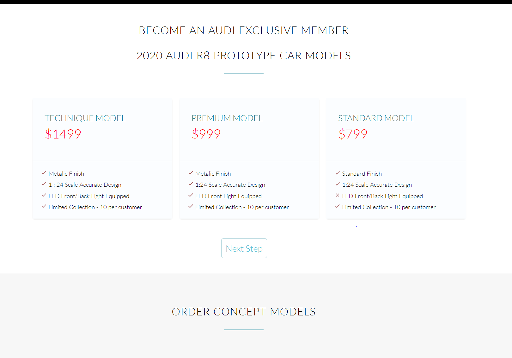
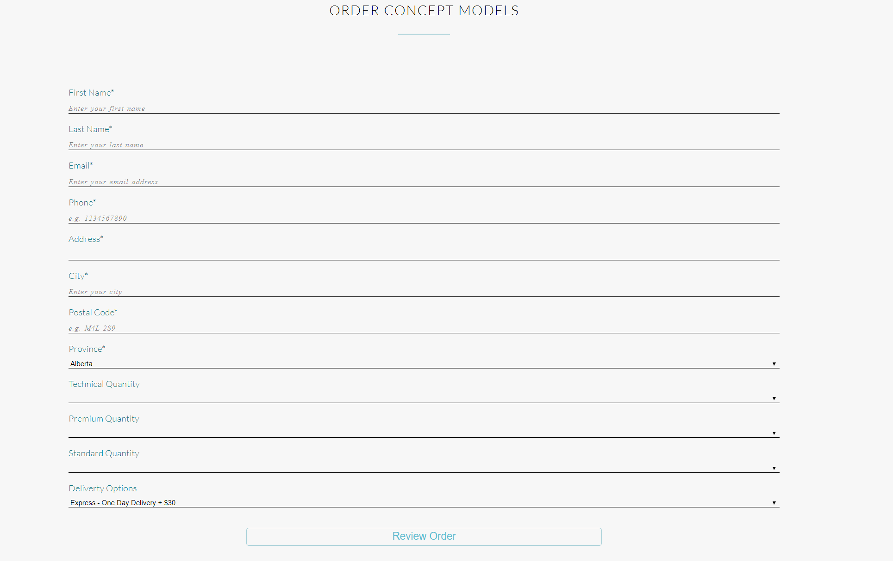
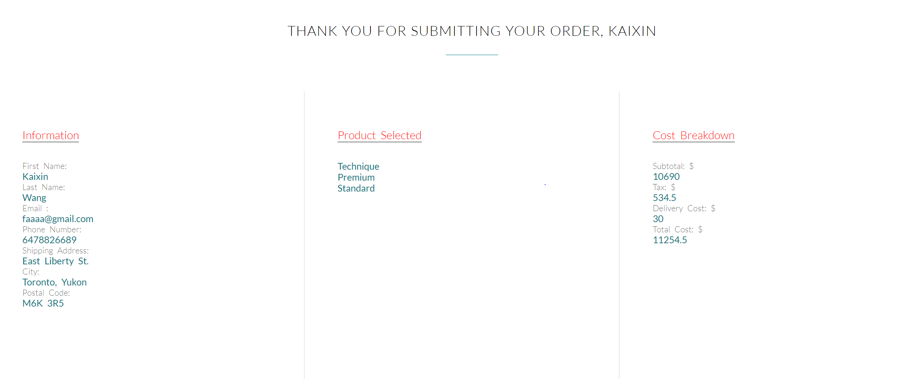

# Online-Store-Server-Validations
Trying out express server-side validations on form inputs. Created a little online store to calculate price, quantity, models and tax. 

Product Intro Page

Model Selection Page

Form

Server side validations

Results

